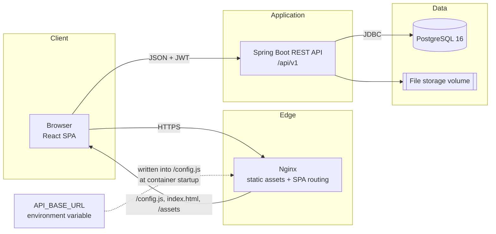
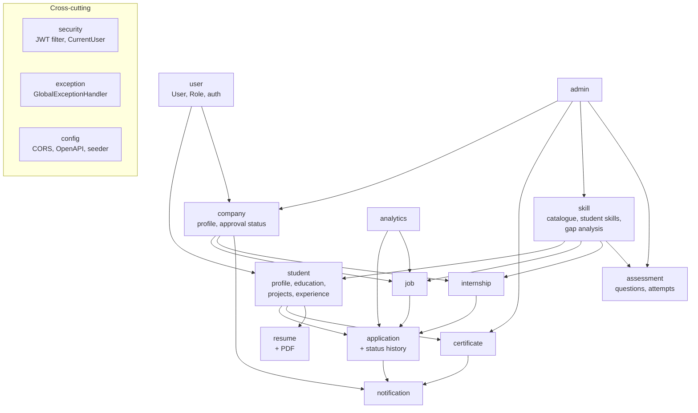
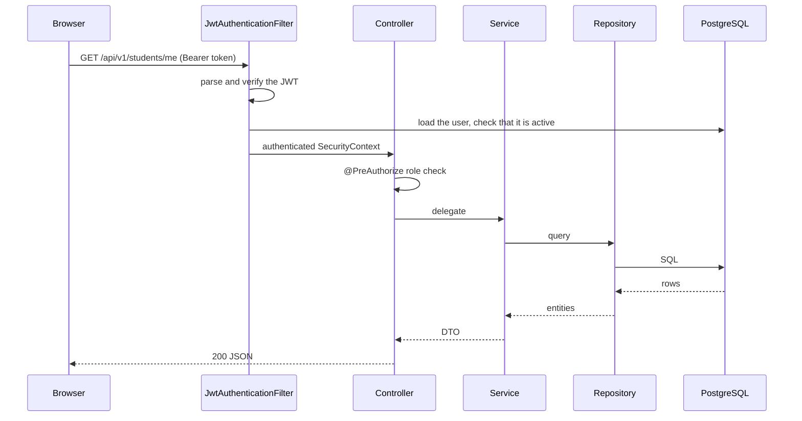
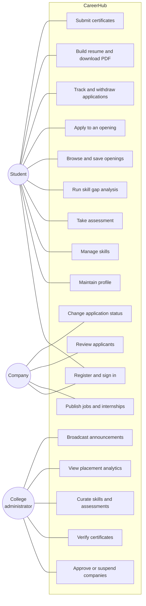
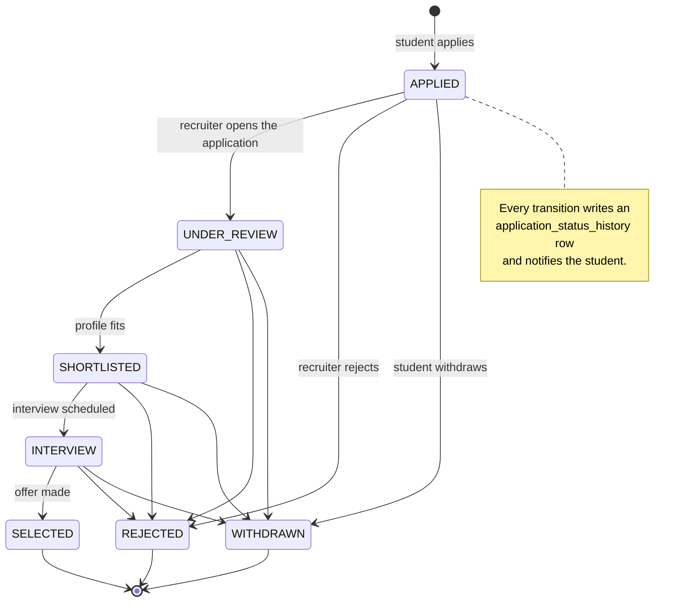
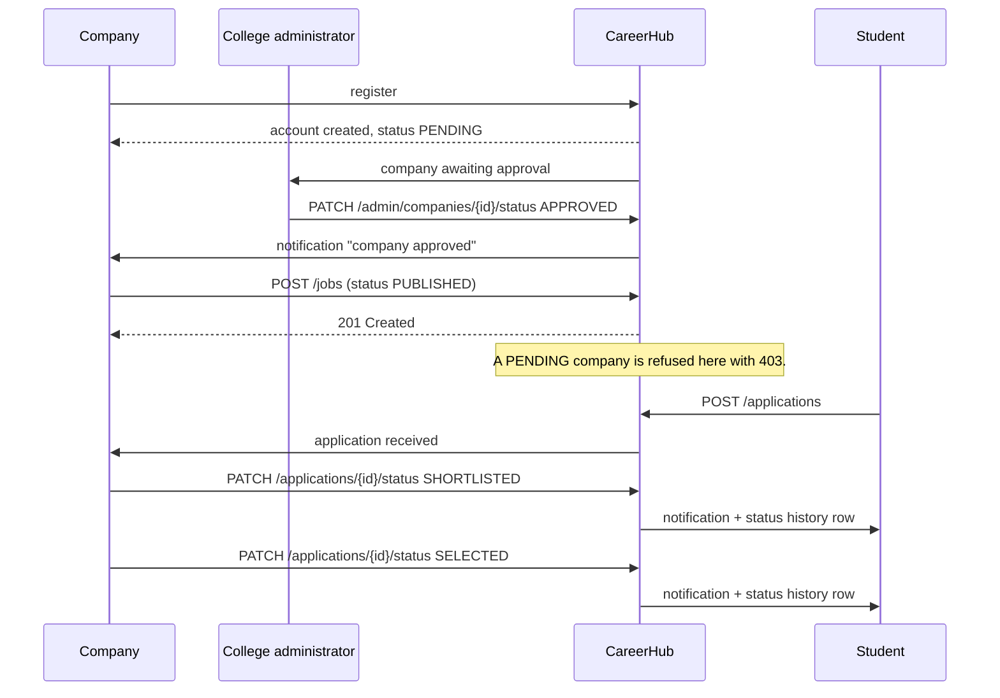
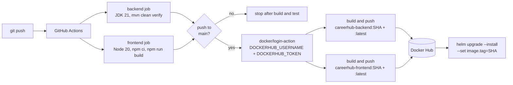

# Architecture

## 1. Style

CareerHub is a **modular monolith**. One Spring Boot process contains every feature,
but the code is split into packages that own their entities, repositories, services,
DTOs and controllers. Packages talk to each other through services, never by reaching
into another package's repository. Splitting a package into a separate service later
would mean replacing a service call with an HTTP call, not untangling the model.

Microservices were rejected on purpose: a single college placement system has one
database, one deployment cadence and one team, so the operational cost of separate
services buys nothing.

## 2. System overview



The browser calls the API directly using the URL it read from `/config.js`. Nginx
serves the SPA; in Kubernetes the Ingress puts both behind one host so the API base
URL is simply `/api/v1`.

## 3. Backend modules



Each module follows the same shape:

```
module/
├── Entity.java            JPA entity
├── EntityRepository.java  Spring Data repository
├── EntityService.java     business rules and authorisation
├── EntityController.java  REST endpoints, validation
└── EntityDtos.java        request and view records
```

## 4. Request flow



An unhandled failure anywhere in that chain is converted by `GlobalExceptionHandler`
into a consistent body: `{timestamp, status, error, message, path, fieldErrors}`.

## 5. Use cases



## 6. Student application workflow



## 7. Company recruitment workflow



## 8. Frontend architecture

```
src/
├── lib/       api.ts (axios + runtime config + interceptors), types.ts, format.ts
├── context/   AuthContext (session), ToastContext (feedback)
├── components/ AppLayout, ProtectedRoute, Ui, Modal, Charts
└── pages/     public/, student/, company/, admin/
```

- `AuthContext` holds the session, restores it on load through `GET /auth/me` and
  clears it when a `401` comes back.
- `ProtectedRoute` guards routes by role. It is convenience only — the backend
  enforces the same rules and is the real boundary.
- `lib/types.ts` mirrors every backend DTO, so a contract change surfaces as a
  compile error rather than a runtime `undefined`.
- Every page handles loading, empty and error states explicitly.

## 9. Security

| Concern | Approach |
| --- | --- |
| Password storage | BCrypt via Spring Security's `PasswordEncoder` |
| Sessions | Stateless JWT in the `Authorization` header |
| Secret management | `JWT_SECRET` and database credentials from the environment, Kubernetes Secrets or a mode-600 `.env` |
| Authorisation | `@PreAuthorize` per endpoint plus ownership checks inside each service |
| Input validation | Bean Validation on every request record; failures become `fieldErrors` |
| SQL injection | Spring Data JPA with bound parameters only |
| CORS | Explicit allow-list from `CORS_ALLOWED_ORIGINS` |
| Assessment integrity | Correct answers never leave the server |
| Database exposure | PostgreSQL is never published to the host or the internet |

## 10. CI/CD pipeline



Tagging by commit SHA is what makes a deployment reproducible: `latest` moves, the
SHA tag does not, so a rollback is a `helm upgrade` with the previous SHA.
