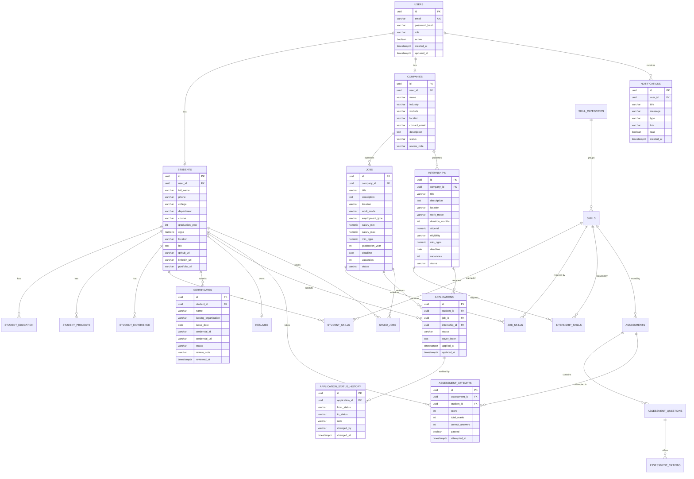

# Database

PostgreSQL 16. Every table uses a `UUID` primary key so that identifiers can be
generated by the application and are not guessable or enumerable. Schema changes are
applied by **Flyway**; Hibernate runs with `ddl-auto: validate` so the application
refuses to start if the code and the schema disagree.

## 1. Migrations

| Version | File | Contents |
| --- | --- | --- |
| V1 | `V1__initial_schema.sql` | All 22 tables, foreign keys, unique constraints, check constraints and indexes |
| V2 | `V2__reference_data.sql` | 9 skill categories and 49 skills |
| V3 | `V3__saved_jobs.sql` | The `saved_jobs` table |

Demo accounts are **not** seeded by SQL. Passwords must be hashed with the same
`PasswordEncoder` the application uses, so `config/DemoDataSeeder` creates them in
Java at startup — only when the `users` table is empty and `SEED_DEMO_DATA=true`.

## 2. Entity relationship diagram



## 3. Tables

### Identity

**`users`** — one row per login. `email` is unique, `password_hash` holds the BCrypt
digest and is never selected into a response DTO. `role` is `STUDENT`, `COMPANY` or
`COLLEGE_ADMIN`. `active = false` blocks login without deleting history.

**`students`** and **`companies`** — the role-specific profile, each with a unique
`user_id` foreign key. Splitting them from `users` keeps the authentication table
small and lets the two profiles diverge freely.

### Student detail

**`student_education`**, **`student_projects`**, **`student_experience`** — child
rows cascading from `students`, each ordered by date for the resume.

**`student_skills`** — the join between a student and the skill catalogue, carrying
`proficiency` and optional `years_experience`. Unique on `(student_id, skill_id)`.

### Catalogue

**`skill_categories`** and **`skills`** — administrator-curated reference data. Every
student skill, job requirement and assessment points at a `skills` row, which is why
skill gap analysis is a set comparison rather than string matching.

### Openings

**`jobs`** and **`internships`** — parallel tables rather than one polymorphic table,
because the fields genuinely differ: a job has `employment_type` and a salary band, an
internship has `duration_months`, `stipend` and `eligibility`. `status` is `DRAFT`,
`PUBLISHED` or `CLOSED`.

**`job_skills`** and **`internship_skills`** — many-to-many joins to `skills`.

**`saved_jobs`** — a student's bookmark list, unique on `(student_id, job_id)`.

### Applications

**`applications`** — one row per student per opening. Two nullable foreign keys,
`job_id` and `internship_id`, with a check constraint that **exactly one** is set:

```sql
CHECK ((job_id IS NOT NULL AND internship_id IS NULL)
    OR (job_id IS NULL AND internship_id IS NOT NULL))
```

Partial unique indexes on `(student_id, job_id)` and `(student_id, internship_id)`
make a duplicate application impossible at the database level, not just in code.

**`application_status_history`** — append-only audit trail. Every transition records
the previous status, the new status, an optional note, who made the change and when.
Nothing updates or deletes these rows.

### Assessments

**`assessments`** → **`assessment_questions`** → **`assessment_options`**. The
`is_correct` flag lives on the option row and is excluded from the student-facing DTO,
which is what keeps scoring honest. **`assessment_attempts`** stores the computed
result rather than the raw answers.

### Supporting

**`certificates`** — the verification queue with `status`, `review_note` and
`reviewed_at`. **`resumes`** — one row per student holding the editable summary,
objective and template; the rest of the PDF is assembled from live profile data.
**`notifications`** — per-user in-app messages with a `read` flag.

## 4. Indexes

Beyond the primary keys and unique constraints, V1 indexes the columns that filtering
actually uses:

- `users(email)` — every login.
- `jobs(company_id)`, `jobs(status)`, `internships(company_id)`, `internships(status)`
  — the public boards filter on `status`, the company board on `company_id`.
- `applications(student_id)`, `applications(job_id)`, `applications(internship_id)`,
  `applications(status)` — the three list views and the analytics aggregation.
- `notifications(user_id, read)` — the unread badge polls this on every page change.
- `student_skills(student_id)`, `job_skills(job_id)` — skill gap analysis.
- `certificates(status)` — the administrator's review queue.

## 5. Conventions

| Convention | Reason |
| --- | --- |
| `UUID` primary keys, generated by the application | No sequence round-trip, identifiers are not enumerable |
| `TIMESTAMPTZ` for every timestamp | Unambiguous across deployment regions |
| Enums stored as `VARCHAR` | Readable in `psql`, and adding a value needs no type migration |
| `ON DELETE CASCADE` on child rows | Deleting a student removes their profile data cleanly |
| No cascade from `applications` to openings | Historical records survive; an opening with applications cannot be deleted |
| `NUMERIC` for CGPA, salary and stipend | Avoids floating-point rounding on money and grades |
